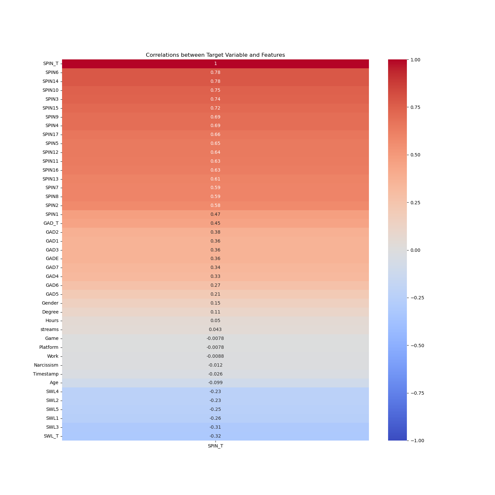
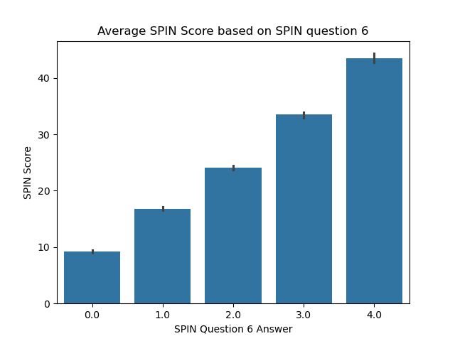
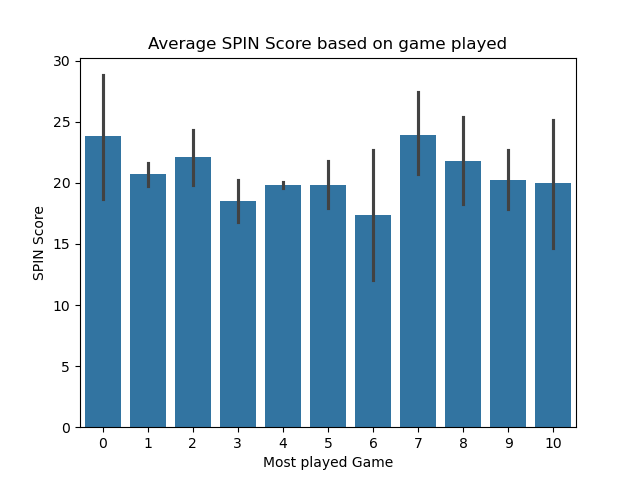
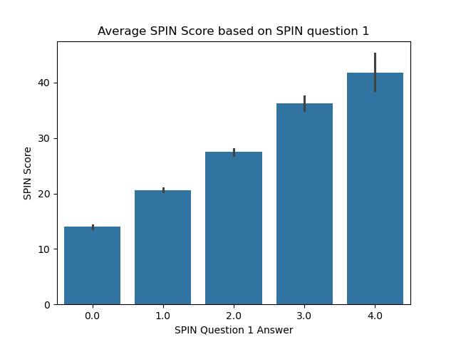

# Gaming Project
## Objective: 
The objective of this analysis is to be able to provide a model which can predict multiple facets related to gaming, for now, I'll evaluate a gamers phsychological health based on their SPIN (Social Phobia Inventory) score, which is basically a metric used to evaluate social anxiety. This will be useful for some reasons...
- See how much of a link their is between gaming and someones social anxiety
- offer individuals to evaluate their own social anxiety, and act accordingly

I am going to fufill this purpose by...
- make the data suitable for modeling
- offering visualizations which highlight why I chose certain features for modeling
- go through the process of making a model in order to develop predictions

---
## PART 1: Data Cleaning
#### Step 1: dropping certain columns
Some of the columns that I had, I decided to drop, because they would've been very cumbursome to work with and interpret in the final model, which I accomplished with the code below.
```python
sub1 = df.drop(['S. No.','earnings','whyplay','League','highestleague', 'Birthplace', 'Residence', 'Reference', 'Playstyle', 'accept', 'Residence_ISO3', 'Birthplace_ISO3'], axis = 1)
```
- this code uses drop on the data frame to get rid of columns I thought would've been hard to work with, and I saved it into a subset called `sub1`

#### Step 2: dropping na values
There were na values that I had to drop as they wouldn't be processed by the model, there also weren't to many which is why it is a good idea.
```python
sub2 = sub1.dropna()
```
- this code uses the dropna function to drop all empty values within the subset, and I seaved this into a new  subset called sub2

#### Step 3: Turning object values into numerical values
I had to change many of the values within the dataset to number based as apposed to text based values, as machine learning models can't handle text based values.
```python
sub2['GADE'] = pd.Categorical(sub2['GADE'], categories= ['Not difficult at all', 'Somewhat difficult', 'Very difficult',
       'Extremely difficult'], ordered = True)

sub2['GADE'] = sub2['GADE'].cat.codes
```
- this code will firstchange the selectred column from the dataframe, "GADE" into a category using `pd.Categorical()`. I had to give it the column name of the data I wanted to change within the function, the categories that were apart of that column, and I made sure to make set ordered to true, as that would ensure that the column will maintain the order of the categories in the way that I give it, improving interpretabillity. next I took that subset and fed it the instances `.cat.codes` which would fetch the cotegorical values and turn them into numerical ones

---
## PART 2: Exploratory Data Analysis (EDA)
#### Visual 1:


this is a Heatmap which shows the correlation coefficients of all the features with the target variable `SPIN_T`. Important as it can help us decide which features to use for modeling

---
#### Visual 2:


A barplot which shows us a Persons Average SPIN score based on their answer to question 6, which is "Fear of embarrassment causes me to avoid doing things or speaking to people.". Shows us that this answer very strongly correlates with a surveyee's SPIN score on average

---
#### Visual 3:


A barplot which shows us the Persons Average SPIN score based on the game that they play most often. shows us that there doesn't really seem to be a srong correlation between the game a person plays and their SPIN score. Though some games may have larger ranges, that could be explained do to some of the games being a lot more popular than others, meaning that there is more data for them and a wider range of answers.

---
#### Visual 4:


A barplot which shows us a Persons Average SPIN score based on their answer to question 6, which is "I am afraid of people in authority". Even though this question has the lowest correlation coefficient with the target, it shows us that they still have quite a strong association


---
## PART 3: Modeling
### Feature Selection
I decided I would use all the features protaining to the SPIN_T as my features as they had teh best correlations with the target variable

### Model Selection
The Models that I decided to use were these...
- LinearRegression
- KNearestNeighbors Regressor
- DecisionTreeRegressor
- RandomForestRegressor

I decided to use these as I was familiar with using them.

---
### Performance
```
Model                   : R squared |
------------------------|-----------|
KNeighbors              :  98.880 % |
LinearRegression        :  100 %    |
DecisionTreeRegressor   :  91.280 % |
RandomForestRegressor   :  97.989 % |
```
- I decided to chose the KNN Regressor as it had my best metrics easily
---
## Conclusion
I served my purpose in this analysis by...
  - making mt data appropriate for modeling
  - making visualizations to understand how I could make my model
  - making a model that makes accurate predictions
---